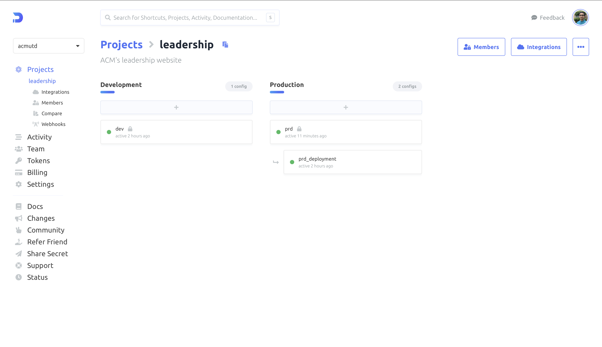

# Local Deployments

The Leadership site is setup to use [Doppler](https://doppler.com) for both local deployments and production.

Doppler is an environment configuration management service. It acts as a substitute for `.env` files by dynamically injecting environment variables at build and run time. Additionally, doppler lets our team manage our configuration variables in a centralized location enabling everyone to refer to one universal source of truth for their local deployments and easily view the production configuration. To get access to the ACM Organization on Doppler, sign in with your `@acmutd.co` account. 



:::caution
When signing into Doppler if you face a 403 - App not enabled for user error, reach out to [ACM Development](mailto:development@acmutd.co). Your ACM account will need to have its permissions in Google Workspace updated to gain access to Doppler. 
:::

### Doppler Setup

The `dev` config on Doppler is used for local deployments. When running `npm run dev`, the environment variables in this config are fetched. All environment variables are listed in this config. To ensure that you are using this config locally follow these steps:

 - Install the [Doppler CLI](https://docs.doppler.com/docs/cli).
 - Login to the Doppler CLI by running `doppler login`. This will open a browser window, make sure to follow the prompts.
 - Setup to use the environemnt variables by running `doppler setup`. Make sure to select the `leadership` project and the `dev` config when prompted to.

Using doppler for environment variables is managed in the `package.json` file. 

```json
"scripts": {
    "dev": "NODE_OPTIONS='--inspect' doppler run -- next dev",
    "build": "next build",
    "start": "next start",
    ...
}
```

The `doppler --` section ensures that the environment variables from Doppler are used. If you'd like to override the variables with an `.env` file instead remove that portion from the `package.json` file.

:::tip
The `NODE_OPTIONS='--inspect'` portion ensures that the server side logs (ex. from api calls, getServerSideProps, etc) are logged to the console running the NextJS application. 
:::

### Runtime Secrets

For local deployments, the codebase fetches server side secrets from Doppler at runtime. This is done by making an API call to Doppler with a [Service Token](https://docs.doppler.com/docs/service-tokens). The `dev` config in Doppler has a service token associated with it called `DEV_DOPPLER_TOKEN`. 

:::caution
For local deployments it does not matter if server side secrets are fetched at build or run time. It would have been been a more efficient architecture to pass in all environment variables at compile time. However, to accomodate for challenges faced in the production environment, some secrets (server side) are fetched at runtime. To mirror the production environment, the local deployments are also setup to pull server side secrets at run time. This helps ensure better replication of the production environment.
:::