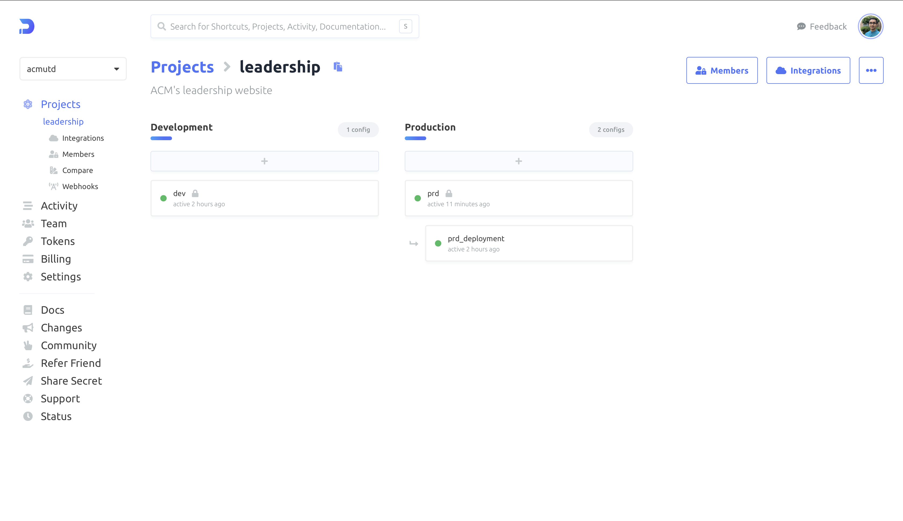

# Vercel

The Leadership Site and the GraphQL API are deployed together on Vercel. 



### Doppler

There are two environment variable configurations in Doppler for the Vercel deployment. Due to the [4kb limit](https://vercel.com/docs/concepts/limits/overview#environment-variables) on the size of environment variables, all the values cannot be synced at once. To overcome this issue, only the necessary environment variables are synced between Doppler and Vercel. The remaining variables are fetched at runtime through the codebase.

This results in the two configs present in Doppler for the production environment --> `prd` and `prd_deployment`. 

### Synced Variables

The `prd_deployment` branch config consists of the following variables:

- All environment variables that will be accessed client side (ex. Firebase Client SDK). These cannot be fetched from Doppler at runtime due to [cors restrictions](https://docs.doppler.com/docs/enclave-service-tokens).
- All environment variables that cannot be injected asynchronously. These include variables that initialize 3rd party libraries or API endpoints that are not under our control (ex. NextAuth).
- Doppler Service Token to fetch all the remaining secrets.

### Async Variables

The `prd` config in Doppler serves as the root configuration for the production environment. It consists of all variables (including those in the `prd_deployment` branch config). These variables are fetched in the codebase at runtime. 

These variables carry two important properties:

- They can be fetched server side. This ensures that the API call to fetch the secrets will not be exposed to the client (potentially leaving the client vulnerable). 
- They can be fetched and passed along to the application [asynchronously](https://docs.doppler.com/docs/sdk-javascript). 

:::caution
The requirement that these variables need to be fetched and passed along asynchronously mean that several pieces of downstream functionality need also be adapted to be asynchonorous.
:::

Fetching the `prd` environment configuration is accomplished through the following function in the codebase. Note that the results from doppler are cached locally in a global variable so that subsequent requests to the environment variables do not result in API calls to Doppler.

```ts
const environment: Environment = {
  initialized: false,
  env: {},
};

const getEnv = async () => {
  if (!environment.initialized) {
    const response =
      process.env.NODE_ENV === "development"
        ? await axios.get<Record<string, string>>(
            `https://${process.env.DEV_DOPPLER_TOKEN}@api.doppler.com/v3/configs/config/secrets/download?format=json`
          )
        : await axios.get<Record<string, string>>(
            `https://${process.env.PROD_DOPPLER_TOKEN}@api.doppler.com/v3/configs/config/secrets/download?format=json`
          );
    environment.env = response.data;
    environment.initialized = true;
  }
  return environment.env;
};
```

### Async Downstream Functionality

Since all of the functionality that uses the asyncronously fetched environment variables from Doppler are isolated to APIs and server side code, most utilities and helper code also needed to be adapted to be async. Below is an example of how the `firebase admin` package was made async.

```ts
import * as admin from "firebase-admin";
import getEnv from "../util/env";

export const getFirebaseAdmin = async () => {

  const env = await getEnv();

  if (admin.apps.length === 0) {
    admin.initializeApp({
      credential: admin.credential.cert({
        projectId: env.NEXT_PUBLIC_FIREBASE_PROJECT_ID,
        clientEmail: env.FIREBASE_CLIENT_EMAIL,
        privateKey: env.FIREBASE_PRIVATE_KEY.replace(/\\n/g, "\n"),
      }),
      databaseURL: env.NEXT_PUBLIC_FIREBASE_DATABASE_URL,
    });
  }

  return admin;
};
```

Here, instead of globally initializing the firebase admin sdk, we are wrapping that functionality into an async function.